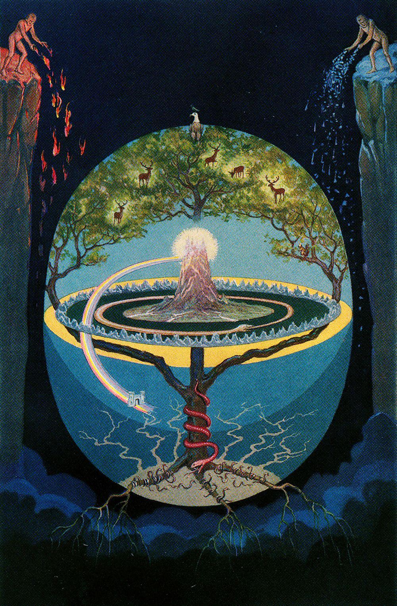

## Quem eu Sou?

Prazer, me chamo **Jonas**, fui Programador, nasci na década de 90 e participei do *Boom* da Internet e da Computação, Brasileiro de nascença, Cosmonauta em essência.

Hoje em dia porém espero ser apenas um Ser Humano, que visa aprender o que é a ética universal. Mas o quão fácil é rotularmos nós mesmos?
Posso dizer que sou o que faço, mas o que faço não é o que sou.

Em geral tenho evitado me apegar a rótulos. Como Jung diria, um símbolo/arquétipo não pode ser quantificado, ele vai muito além do que a forma lhe propõe. O símbolo é pura energia e, dependendo dos nossos complexos, moldamos a energia do símbolo à forma que mais remete às nossas experiências.

**Filosofia**, palavra que vem do grego que significa literalmente: _"Amor ao conhecimento"_.  
Isso define minha vida, meu jeito de ser (às vezes até um pouco extremo para a infelicidade dos que vivem comigo).

Filosofia para mim vai além da reflexão sobre o funcionamento do mundo, ela é, em suma, a Linguagem do universo e a Matemática é sua abstração.

Seguir a filosofia significa ter integridade, manter um padrão flexível (parece paradoxal, não é mesmo?), onde se visa unir o saber das pequenas coisas no viver das grandes coisas.

---
## Por que esse blog existe?

Conforme pode ser visto nos primeiros posts do blog, no final de 2024 passei por um processo que alguns estudiosos chamariam de _"Noite Escura da Alma"_.

Durante muito tempo da minha vida me dediquei a uma existência sem sentido, depressiva e melancólica.  
Apenas sobrevivia, sem viver, sem enxergar que a vida é mais simples do que parece, mas ao mesmo tempo infinitamente bela e inexplicável.

Esse processo foi brutal para mim, mas hoje sei que sem ele eu não estaria aqui. Essa chamada da vida me levou a perceber que dignidade não é apenas uma palavra, é um direito de todo Ser Humano.  
Todo mundo tem o direito de ser Digno de Si, do seu valor numinoso, do seu símbolo inextricavelmente complexo dentro da criação e que ninguém deve aceitar ser menos que isso.

Dentro disso, passei a ver o quão essencial é a cooperatividade e não a competitividade, a necessidade de se conectar, de tratar o outro (*outro entendível por Mulher, Homem, Animal, Planta, Mineral...)* como um igual. Então fiz o melhor que pude, estudando para construir meu autoconhecimento.

Autoconhecimento para mim é uma chave, tão necessária e mesmo assim tão negligenciada nos dias de hoje. Autoconhecimento não é só saber o que se é, é saber o que não se é, o que falta para Ser.

Dentro desse estudo, percebi a necessidade vital de reforçar esse conhecimento, mas como eu poderia reforçar isso? Além de todas as mudanças que fiz para viver minha vida da maneira mais Leve e Justa possível, decidi escrever, e em um ano escrevi algumas centenas de folhas.

Sei que isso não é muito, mas notei a necessidade de compartilhar essas reflexões e por isso esse blog nasceu, para que eu possa reforçar meus ensinamentos e reflexões e quem sabe, também ser útil para outrem.

---
## O que eu pretendo escrever aqui?

No caminhar da vida, no sobe e desce nas escadas das Leis do Tempo, sempre acabo me deparando com algum assunto que me parece de vital importância. Não me importo se esse assunto já parece esgotado ou não. Se o assunto me parece importante eu quero refletir sobre o mesmo e tirar minhas próprias conclusões, baseadas em todos os ângulos que eu conseguir tatear com a fraca Luz que viso manter acesa.

De qualquer forma é essencial que eu Escreva, exteriorizando aquilo que vem do meu interior. Assim sou capaz de julgar um pouco da qualidade do que sou e o que preciso mudar.

Viso me tornar um Ser Universalista dentro da Luz do Conhecimento. Essa frase pretensiosa em si mereceria um post dedicado somente a ela para explicar tais termos, mas resumidamente é:

_"Alguém que busca na compreensão e no viver as respostas para os grandes mistérios da vida, respeitando o próximo e se responsabilizando por tanto quanto eu tiver forças para isso."_

Sim, falarei muito sobre esoterismo aqui, mas se você tem essa busca pela pura curiosidade frívola ou se está atrás de ensinamentos irresponsáveis sobre magia, saiba que está no lugar errado, pois antes de tudo eu acredito na Teurgia, a crença de que não precisamos de nada de especial para Sermos Um com Deus. O inexorável é sempre Justo e só precisamos do Coração cheio de Sinceridade e de Amor para Sermos tudo aquilo que precisamos Ser.

Minha visão é a visão da união, de que todos os credos falam da mesma Luz, de que todos os Mitos exibem a mesma fonte. Somos todos uma grande família mesmo que não nos identifiquemos com isso.

Dentro do meu estudo pretendo caminhar do Ocidente ao Oriente. Até agora o parceiro mais próximo do que penso tem sido Jung, o mesmo sendo capaz de sumarizar muito do que penso sobre o processo evolutivo do Ser e de como Tudo é Um e de que o Um está em Tudo. Então espere ler bastante sobre ele aqui.

---
## O que é "um" Pleroma afinal?

Pleroma, do Grego, significa "Totalidade".
O Pleroma é o Tudo e o Nada, é a Existência e a Não-Existência, é o Tempo e a Ausência do Tempo, a Luz e a Ausência de Luz.

Não é possível refletir sobre o Pleroma pois o mesmo é algo muito além do mundo das formas e do que a polaridade pode definir, ele apenas É e Não É, tudo aquilo que sempre Foi.

---

*A Árvore da Vida por J. Augustus Knapp*