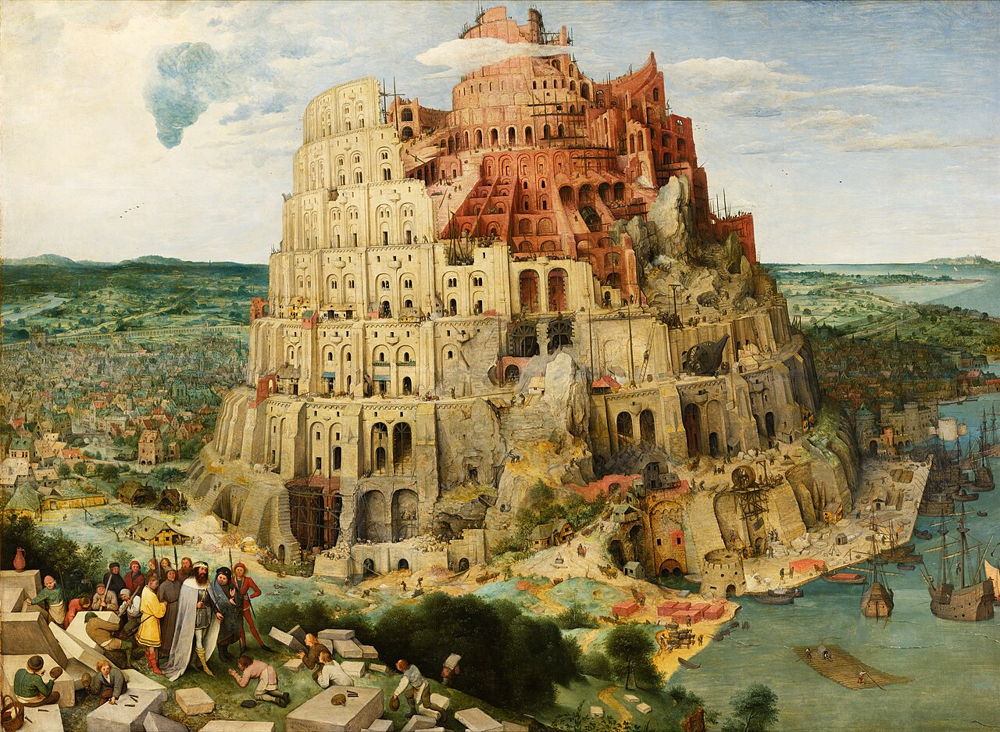

## Ciência e Espiritualidade, amigos ou inimigos?

Vivemos talvez na época mais polarizada do nosso mundo, onde é exigido o posicionamento de cada Ser Humano.
É de tal time ou daquele outro? É de esquerda ou de direita? Gosta de tal figura polêmica ou não?
Prefiro me abster desse tipo de indagação atualmente, a sabedoria Chinesa enxerga os polos não como contrapostos, mas como **complementos**.

Essa busca por um posicionamento firme não poderia deixar de ser diferente para aqueles que acreditam OU na ciência OU na espiritualidade, porém nem sempre foi assim, na realidade, essa revolta em relação ao espírito é recente, a cerca de 200 anos atrás, não existia ciência, o que seria chamado hoje de estudo cientifico se referiria a filosofias naturais.

As filosofias naturais eram muito mais abertas em relação a existência do espírito e se não fosse grandes nomes como Paracelso, um Alquimista e revolucionário médico, que acreditava totalmente na transcendência da matéria, talvez jamais nossa química e medicina teria se desenvolvido do jeito que se desenvolveu.

Não há dúvida de que a ciência trouxe progressos enormes para nossa sociedade, diminuiu a mortalidade, a algumas décadas atrás talvez estivéssemos no período mais pacífico do mundo por causa da ciência (infelizmente o mesmo não pode ser dito hoje).
Mas o quanto é válido desistirmos do espírito, desistirmos de encontrar o sentido da vida ou de responder os grandes mistérios? De onde viemos para onde vamos?

Diante de uma relação clínica, quase estéril, a ciência busca responder essas questões que ao meu ver, ainda estão muito sombrias seguindo o método racional.
A teoria do Big Bang, a data da criação do universo, as constantes cartesianas da física moderna, estão todas por um fio, pois graças a nossos incríveis telescópios, cada vez descobrimos mais "anomalias" no cosmos, que não respeitam nossas teorias.
Os cientistas espaciais, físico teóricos e afins estão em ardentes discussões sobre como essas diferenças tão discrepantes no cosmos diante dos nossos modelos atuais deveriam ser tratados.

Não acredito que a busca por explicação é inútil, muito pelo contrário, a dúvida é essencial para a evolução do Ser, mas temos que abandonar nossa Hubris intelectual, descer um pouco do pedestal que construímos com a admiração sobre a ciência nos últimos tempos e admitir: Sabemos pouquíssimo sobre o mundo que nos cerca, então por que devemos descartar possibilidades?
Será que os sábios e filósofos de antigamente eram tão ingênuos assim? Será que os mesmos só viam o universo da forma que viam pois não tinham um contraponto cientifico como matéria de estudo?

---
## Psicologia e Racionalismo

Segundo muitos filósofos e psicólogos (tal como Jung), a perca da crença humana em algo maior, transcendental é prejudicial para nossa psique.
A crença de algo maior nos traz sentido, uma linha ética e esperança.
Não devemos confundir isso com fanatismo religioso, me refiro a quantidade saudável de espiritualidade que faz valorizarmos a melhor parte do Ser Humano, sua empatia e compaixão.

Vivemos uma vida mecânica, com a ânsia de ter e o tédio de possuir, alimentando um vazio interior que não pode ser preenchido por matéria, o Ser Humano precisa de um sentido para viver, sem isso, não somos capazes de valorizar mais que superficialmente o que nos cerca.

Quando nos rendemos ao puro racionalismo, tudo vira um jogo de ganhos e perdas, vidas e Seres Humanos viram números e estatística.
E se temos uma visão antropocentrista, passamos a acreditar que somos o centro do nosso habitat, quando na realidade... Não somos, nós dependemos e muito de diversos fatores que sequer entendemos.
Mesmo que cultivemos boas intenções para conosco, buscando um progresso consciente em relação as classes sociais, ainda estamos esquecendo que a natureza que é o que nos dá todo o conforto, alimentação e saúde que precisamos.

E citando agora ainda a questão instintiva, segundo os estudos dos antropólogos, o Ser Humano trás um entendimento e um respeito pela natureza antes sequer de perceber a própria consciência, temos milhões de anos acumulados a crenças mitológicas e seres espirituais.
Assim como o corpo se desenvolve e evoluí de maneira gradual, a mente também, temos o que é chamado de inconsciente que abriga as experiências e instintos de sobrevivência de nossos ancestrais, abandonar toda e qualquer crença no espírito é como decepar um membro ou órgão julgando não precisar mais dele, de maneira abrupta.

É possível ser racionalista e acreditar no que não podemos ver ou observar com todos os nossos sentidos, pode um Ser Humano ver um Quark ou Glúon a olho nu? Não seria talvez a questão só de criarmos métodos e ferramentas capazes de ver aquilo que nossos antepassados julgavam místico e transcendente?

O Ser Humano enxerga apenas uma pequena faixa do espectro de cores, ouve uma pequena faixa de Hz das Ondas, sente e é capaz de interagir apenas com uma ínfima parcela do que nos cerca, a mente nos leva a acreditar que aquilo o que podemos interagir é apenas o que existe, pois isso nos dá segurança.
Porém o quão diferente seria nossa realidade se de fato pudêssemos perceber tudo aquilo que existe?
Será que nossas máquinas e instrumentos podem substituir totalmente o que nos falta nos nossos sentidos?

Eis a minha opinião crua: 
Ciência e Espiritualidade apenas são frutos da mesma árvore, não se pode ignorar os fenômenos mediúnicos que existiram e existem, não se pode ignorar as sincronicidades e a relação da consciência com o "mundo exterior".
Eventualmente descobriremos de maneira racional e causal como esses elementos ocorrem e como fazem parte do mesmo universo puramente tátil que a ciência acredita que existe, mas creio que teremos pouca ou nenhuma chance de chegar a esse entendimento se continuarmos criando barreiras e preconceitos em relação a tudo aquilo que não parece racional.

É exigido maturidade do pesquisador, para que saiba separar o que podemos provar do que não podemos provar, sem negar de prontidão a existência de tal.

---
## A busca por Poder

É também necessário estarmos atentos atualmente ao objetivo daqueles que detém o poder sobre a massa, os ricos e famosos.
Não digo para colocarmos chapéu de alumínio e acreditarmos em toda conspiração que existe, mas é um fato observável que quem detém o Poder, busca manter ele.
É uma questão natural e instintiva do ser humano buscar cada vez mais e mais uma posição de segurança e sobrevivência.

E dentro dessa busca por Poder, uma estratégia clássica criada é a de "Nós contra eles", que vem da antiguidade "Dividir para Conquistar".
A polaridade é alimentada por aqueles que detém os meios de comunicação e produção, por um simples motivo: Isso nos mantém ocupado, não perdemos tempo questionando sobre a realidade ou sobre a intenção dos poderosos.

O extremismo é muito prejudicial e ameaça nossa própria existência, devemos ter os braços e a mente aberta para aqueles que julgamos nosso oposto, caso contrário, acabaremos por comprovar a Teoria do Grande Filtro.