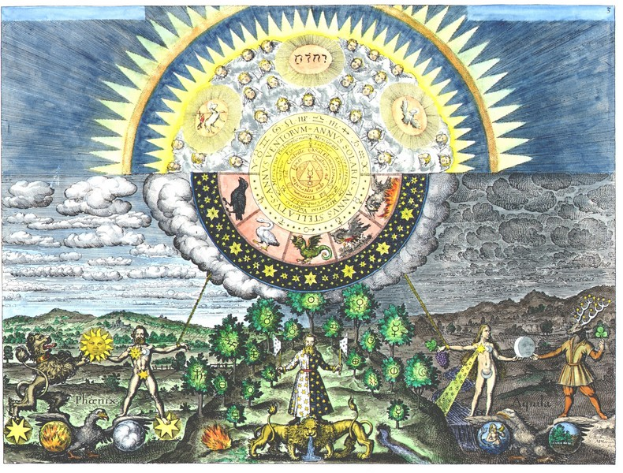
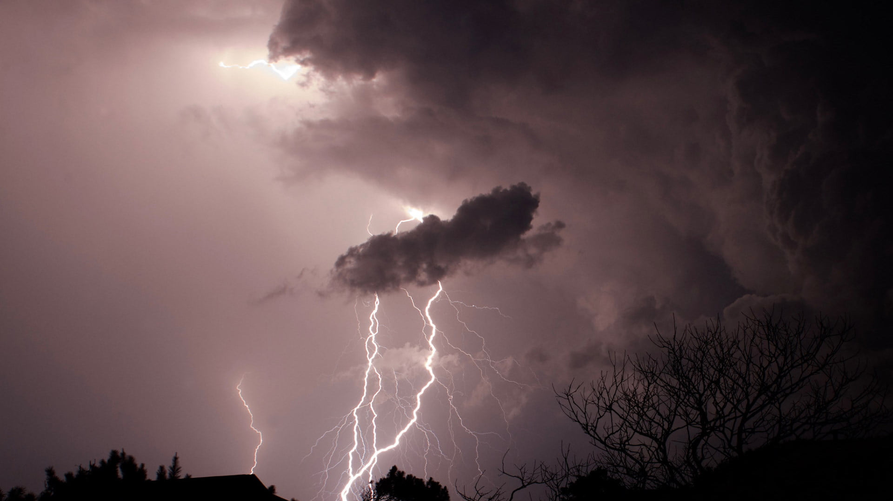
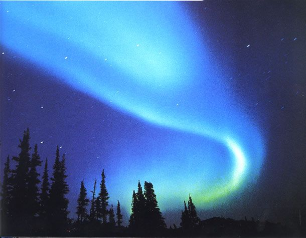
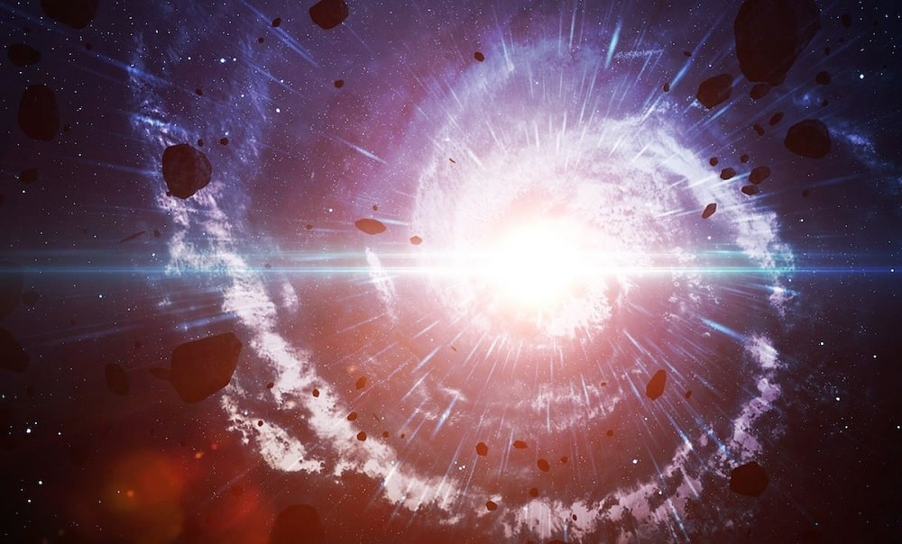

## Pré-consciente

Supondo que trabalhamos na reflexão do primeiro post dessa série [Conhecendo a Si Mesmo I](posts/conhecendo-a-si-mesmo-i.md). É hora de aprofundarmos um pouco mais no funcionamento de nossa *psique*.
Tendo a percepção de que a vida tem tendencia a mudar e evoluir e os traços da transformação costumam se manter no Ser transformado até serem possivelmente descartados através da evolução e seleção das espécies, existe o consenso de que o Ser Humano ainda possui traços do Instinto Animal e da luta pela sobrevivência em si e em vários de seus sistemas autônomos, como traços iniciais da evolução como mamífero.

Seguindo nesse contexto, há o entendimento também de que a consciência é uma aquisição relativamente nova, ainda frágil e pouco entendida, e que essa aquisição não surgiu simplesmente do nada, mas sim se desenvolveu, ciclo por ciclo, através dos milênios.
Em algum momento o homem passou a viver na consciência porém o mesmo não sabia o que era a consciência, sendo assim, a consciência vivia lado a lado com o inconsciente, o arquétipo era a vivencia objetiva.
A natureza do Homem era uma realidade e não vivia apenas nas abstrações do estudo da psicologia, nas trevas do inconsciente.

O que subestimamos hoje em dia, é que essa força ainda existe em nós, ainda não descartamos nosso cordão umbilical com a Natureza e seus estímulos de sobrevivência ainda estão totalmente presentes.
A consciência parece reinar e dominar o espírito Humano, parece possuir a Natureza, porém isso é um ledo e perigoso engano, a realidade é que a consciência faz parte da Natureza, é um mecanismo e ferramenta produzida por um organismo muito maior.

Por isso é imprescindível que entendamos o mecanismo que a natureza criou para nossa evolução, é necessário que vasculhemos as partes mais antigas de nossa existência para compreender a nós mesmos, caso quisermos entender de onde vem o cerne de nossas vontades e desejos.
A consciência não é algo que é desenvolvido individualmente em cada Ser, mas é algo hereditário, personalista e que evolui, como um órgão físico que é influenciado pelo DNA e daí que vem a noção do Pré-consciente.

Pré-consciente é o gérmen do nosso sistema psíquico, plantado por nossa parte inconsciente, natural e hereditária, para que a consciência possa existir e florescer, é necessário que haja uma *blueprint*, um plano, e é aí que o conceito de padrões arquetípicos e símbolos entram na conversa.

## Arquétipos 

Acredito que seja um desserviço eu vir a apresentar a prova da existência dos arquétipos, sendo que os mesmos já são vastamente comprovados na obra de Jung e seus discípulos, então me preocuparei em conceituar o que é um arquétipo e se o leitor quiser entender como foi comprovada a existência dos arquétipos, recomendo que leia a obra Jungiana.

Um arquétipo não possui forma, ele não é polarizado, ou seja, é neutro. Ele é um conceito que possui padrões, assim como a planta de uma casa que ainda não foi construída.
A forma que o arquétipo toma varia com a época e a experiência de vida do Ser Humano, porém o mesmo também pode se apresentar de forma espontânea e trazendo traços e aspectos jamais vividos pelo Ser em questão.

O inconsciente e os arquétipos são como o bloco matriz das construções psíquicas, é como se houvêssemos um conjunto de vizinhos ao lado da nossa consciência, onde num mundo ideal, trabalham e se autorregulam para que a consciência possa ter uma vida plena. Uma boa analogia seria de que nossa consciência vive num verdadeiro Show de Truman interior, onde os arquétipos são os empregados que mantém o Show e formam a compreensão e interação dos aspectos da realidade experienciados pelo Consciente.

Não existe um conjunto definido de arquétipos, da mesma forma que não se pode rotular um Ser Humano, existem infinitas formas de "Ser" Humano, porém um conceito possuí consenso, a realidade da evolução, tudo na Natureza quer evoluir e busca evoluir e a função dos arquétipos é essa, nos manter estáveis e a caminho da evolução.

Os arquétipos podem ser melhores observados através das vivências diretas com o inconsciente que vem principalmente através dos sonhos e fantasias. A realidade é que o inconsciente está presente a todo momento em nossa vida e o coletivo é toda hora moldado pelo inconsciente e suas projeções, ou seja, os arquétipos estão presentes na existência material e objetiva, sendo assim numa análise mais ousada poderíamos opinar que tudo é arquetípico.

# O Inconsciente

O inconsciente muitas vezes é tratado como algo alienígena, do lado de fora, algo hostil, algo que deveria ser descartado, quando é totalmente o contrário. É algo que está do lado de dentro, que vivenciamos a todo momento e faz parte de nós e que tem o papel de nos ajudar e não de nos prejudicar.

Se não existisse inconsciente provavelmente nem teríamos chegado nesse ponto da evolução, é um sistema onde cada mecanismo tem o seu papel e também não existe nada comprovando que o inconsciente vá deixar de existir, que ele é como um apêndice criado para ser descartado pela evolução.

Na realidade me parece que faz parte da vida e do viver, para que a consciência possa existir e nós possamos sentir o livre-arbítrio que nos cerca, é necessária a existência do inconsciente, através do atrito entre o racional e o irracional se gera a energia que move o Ser Humano, por isso é essencial que entendamos nosso irmão mais velho, que vive dentro de nós e que tenhamos uma boa relação com ele.

Aquele que sabe ouvir o que vem de dentro, seus Sentimentos, suas fantasias, que busca entender o que está sendo comunicado de forma simbólica tem a possibilidade de se tornar mais unificado e mais estável consigo mesmo, e o segredo pra isso é simples porém doloroso: Aprender a assumir seus erros, se responsabilizar por suas falhas e olhar diretamente para suas fugas e projeções.

E isso não é segredo por que ninguém sabe, é uma coisa simples de saber, é segredo por ninguém querer ver, é difícil achar alguém que queira ver e é mais difícil achar alguém que de fato faça algo a respeito, pois é muito fácil ter uma vontade mental de mudar, mas na hora de agir ir pelo que é mais conveniente. 

O inconsciente também não está abaixo da consciência, ele a permeia e a circula, está em cima e embaixo, de um lado e do outro. Nesse ponto não existe hierarquia, cada coisa cumpre seu papel, devemos abandonar o pensamento polarizado, linear e competitivo que é ensinado pelo pensamento ocidental.

Muitas vezes o inconsciente pode servir de guia, de pai, de pilar, mas muitas vezes ele pode nos trazer algo transcendental, superior, supra humano. Por isso que sua existência não pode ser categorizada como linear ou algo a ser "superado". Ouvir o seu inconsciente é ouvir tanto sua parte mais primitiva, quanto sua parte mais sábia.

## A Consciência

E qual o papel da consciência nisso tudo? A consciência pode ser modularizada em diversas apresentações: Ego, Persona, Mente.
No momento não vou me ater a uma apresentação específica, mas para mim vou citar o que sinto que de fato é a consciência.

A consciência é a liberdade e ao mesmo tempo nossa ferramenta intermediadora, não é papel da consciência criar tudo por si própria, o papel dela é unir, unir o que o inconsciente nos trás através dos sentimentos e o que pensamos através de nossa racionalidade, o papel da consciência é muito mais de finalização e organização.

Por isso devemos ter sempre humildade em relação a o que somos, não somos superiores a nada, somos o resultado de um processo que deve ser respeitado, a última decisão é da consciência, mas isso não significa que tudo gira em torno da consciência.
Acreditar que o Homem é o centro do universo é o mesmo que acreditar que o Sol gira em torno da terra.

Nossas decisões é o que fazem a consciência, todo caminho a qual nos enveredamos, tudo o que construímos e onde vamos parar é responsabilidade das nossas ações, não existe nada que sintonizamos que não seja responsabilidade nossa e por isso é tão importante o autoconhecimento.

Tomar uma atitude inconsciente em determinado momento não é desculpa para não nos responsabilizarmos por nossas ações, pois é nossa responsabilidade sabermos nos comunicar com nosso inconsciente e estarmos presentes em nosso viver.

“Até você tornar o inconsciente consciente, ele irá dirigir sua vida e você chamará isso de destino.” C.G. Jung.

## A vontade

A vontade sempre foi um assunto complexo e muito debatido entre os psicólogos e psiquiatras pesquisadores, de onde vem a vontade? O que ela é?
Por certas culturas chamada de alma ou anima, do ponto de vista psicológico é visto como a energia de movimento, as vezes também chamada de libido.

O fato é que a vontade é aquilo que move nossas ações, é muito difícil de ter consistência e construir algo sem a presença da vontade e eu sinto que isso é algo muito pouco compreendido hoje em dia.
O mundo se tornou algo muito mental, lógico, preciso de dinheiro logo preciso desse trabalho, preciso dessa faculdade, preciso ser aceito então vou vestir determinada roupa, vou agir de determinada forma.

Tudo isso são escolhas mentais, nenhuma fala de vontade, sem o verdadeiro movimento dessa energia psíquica, não somos capazes de estarmos realmente presentes em lugar nenhum, sempre vamos estar procurando alguma fuga inconsciente, sempre vamos estar praguejados pela ansiedade.

Para entender nossa vontade é necessário entender a Si Mesmo, a vontade é o atrito entre o mental, a escolha visível e as emoções e complexos do inconsciente que temos dificuldade de detectar muitas vezes.

Esse atrito é a essência para nossa sobrevivência pois nada podemos fazer de sólido sem a vontade, a mesma é muito romantizada nos mitos e contos por milênios, é a nossa parte visceral que precisa ser respeitada e ao mesmo tempo direcionada para aquilo que nos faz feliz.

Sem respeitar a vontade adoecemos, primeiramente psicologicamente e então fisicamente, pois nada podemos fazer sem essa energia da vida, nos tornamos apáticos e despersonalizados.

Não acho que seja coincidência estarmos vivendo verdadeiras epidemias de transtornos psicológicos no atual momento da sociedade, onde se coroa e endeusa a razão e a lógica.

A nossa vontade é algo que vai muito além do mental, ela é formada por nosso projeto de vida, nossas construções e quem nós somos, é muito difícil de entender a nossa vontade se não temos uma visão clara do que verdadeiramente estamos buscando em nossa vida e como nos comunicamos com o ambiente.

## Como lidar com o atrito entre o consciente e inconsciente?

Recomendo um simples exercício, tirar um tempo do dia para reflexão, não precisa ser muito tempo, mas é importante que seja num momento calmo e sozinho.
Durante esse período você irá refletir sobre o seu dia a dia, especificamente as coisas que mais lhe moveram emocionalmente durante o dia.

O que te deu raiva? O que moveu seu instinto? O que te deixou triste? O que te deixou feliz? 

Dentro dessas questões costumam ter fortes interações inconscientes, reflexos de nossos complexos e construções arquetípicas, realmente busque uma reflexão neutra, por que esse evento moveu essa emoção em mim?

É importante ouvir seus sentimentos nesse processo, você pode ter uma resposta mental "na ponta da língua" para aquele movimento em você, mas o seu sentimento pode indicar que tem algo de errado aí, algo que você não quer ou pode ver no momento, é necessário ir mais fundo e é aí que as revelações sobre Si se desenvolvem.

Se esse eventos envolvem outras pessoas, busque se colocar no lugar das outras pessoas, de uma maneira não julgadora, mas com as construções que aquela pessoa tem, a verdadeira empatia vem de compreender sem aceitar, de saber que a vida daquela pessoa tem um caminho diferente da do seu, com suas próprias construções e escolhas. Evite o excesso de moralismo.

Ao refletir sobre esses gatilhos emocionais, que podem ser positivos ou negativos, tente montar um rascunho de quem você é, podem levar várias sessões para que isso se torne claro, não tenha pressa, o importante é descobrir como e por que você reage ao que está ao seu redor, uma visão neutra dentro do que essas reações fazem sentido com o todo.

Também esteja atento aos seus sonhos, mesmo que você não os entenda, não busque tentar entender se as coisas não fizerem sentido, tentar colocar os sonhos na caixinha racional não funciona, os sonhos são o que são, eles não foram criados para serem racionais, eles são pura expressão sem filtro de nosso inconsciente e muitas vezes estão nos comunicando o que precisamo saber sobre nós.

Comunicar-se é um ato que merece um Post só para ele, a comunicação vai muito além do racional e da linguagem, tudo busca comunicar algo e nos passa alguma informação, a comunicação existe muito antes da razão existir.

Se esse exercício for feito com certa frequência, sua capacidade de estar presente e consciente durante o seu dia a dia pode aumentar muito, pois você passará a notar os gatilhos enquanto acontecimento e aí você ganhará uma capacidade de decisão maior em sua vida.

"Isso mexeu comigo, mas será que devo reagir assim? É justo com essa pessoa e com o ambiente que quero construir pra mim?"

E lentamente vamos ouvindo o que nosso inconsciente quer nos informar e tomando o verdadeiro papel da consciência, de intermediador entre o interior e exterior.