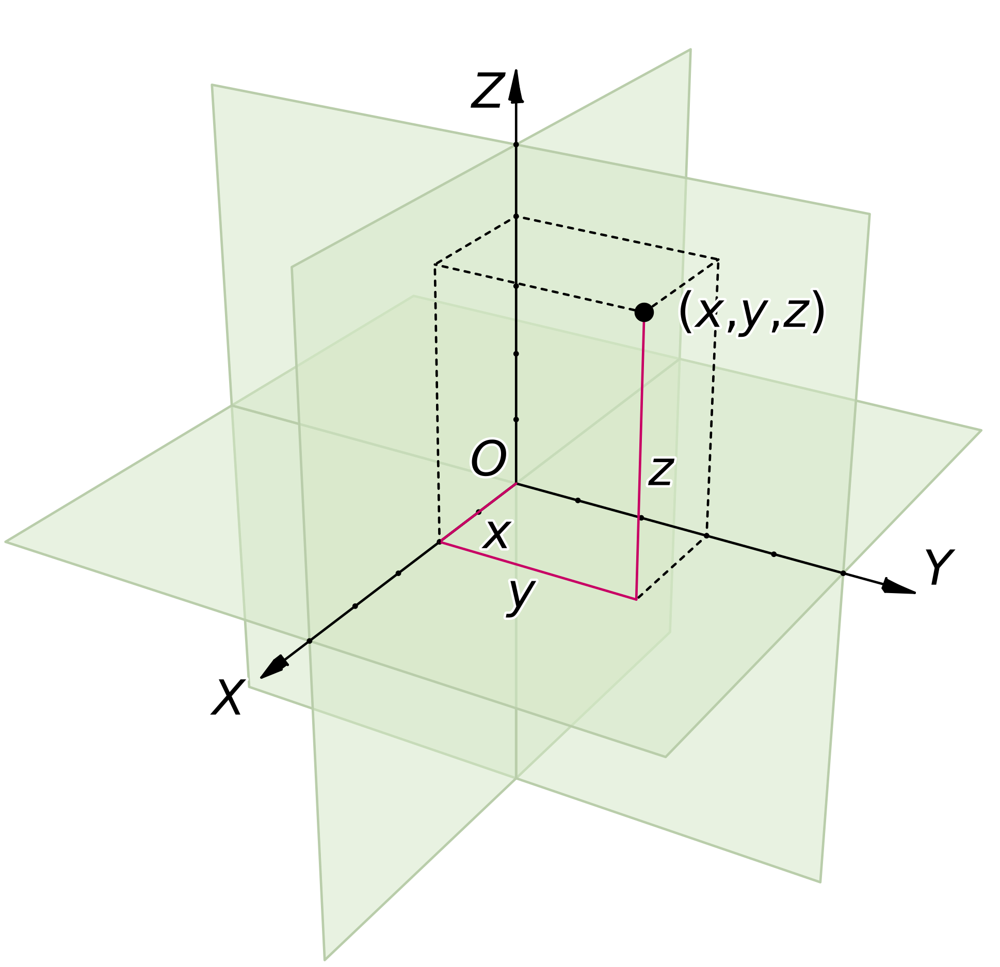
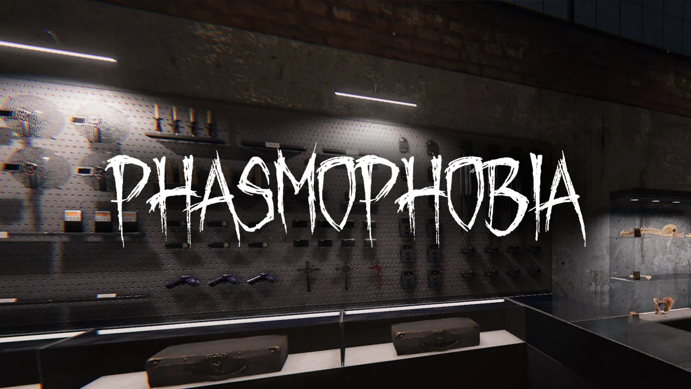
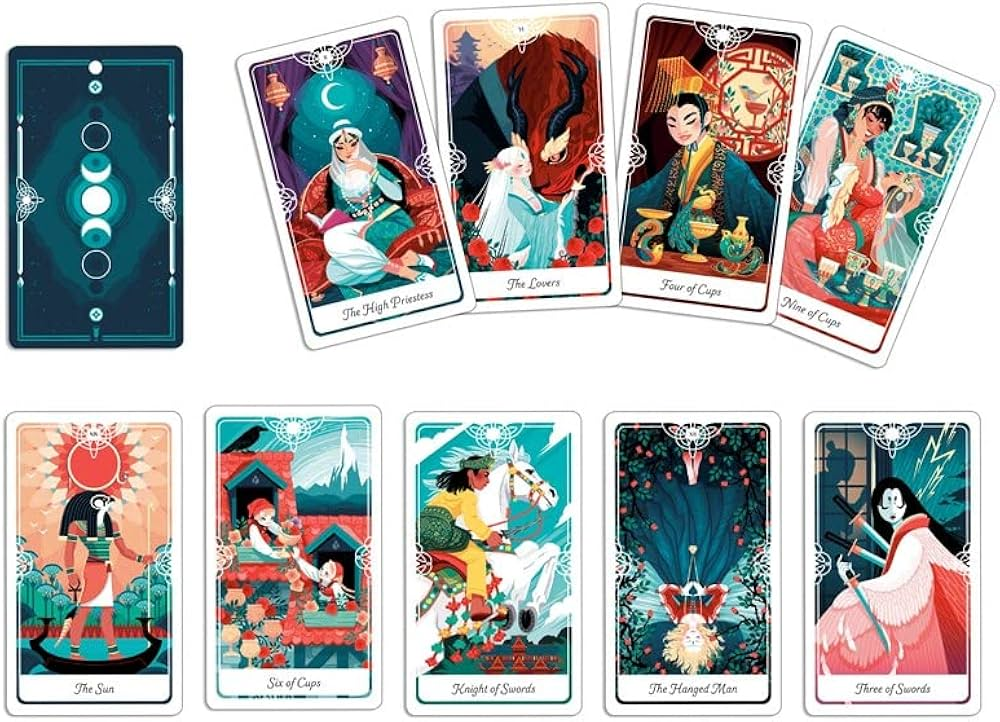

## Despertar, sonho ou pesadelo?

No universo em que vivemos, tudo que não é virtual possui 3 eixos, altura, largura e comprimento.
Cada um desses eixos possui um ponto central (0), que varia ao positivo ou ao negativo.

No nosso mundo todos os eixos tendem a ter um centro, e então a esquerda desse centro temos o valor negativo e a direita o valor positivo.
Ou seja, tudo é passível de ser analisado do ponto positivo ou negativo, mas não estamos falando de bem ou mal aqui, pois esses valores são relativos, estamos falando de ângulo e ponto de vista.

O que pode doer pra alguém pode ser a felicidade de outro, e quando colocamos o tempo na jogada então, o que doeu hoje pode não doer mais amanhã.

Assim é o despertar, no momento em que você o vive é a pura escuridão, mas o Sol sempre nasce novamente e então você percebe que na realidade recebeu uma grande benção.

---
## Geração dos Anos 90

Sinto que a geração em que nasci foi muito negligenciada, não há culpados e nem vítimas, mas no geral, a sociedade avançou um absurdo em termos de tecnologia e comunicação nesse período.
Ninguém sabia a capacidade e os efeitos que a Internet fariam no psicológico das pessoas, minha geração sentiu isso como a força de um Trem.

Todos aqueles Jovens e Crianças que tiveram exposição a longos períodos na Internet sem supervisão (e foram muitas pessoas), tiveram vários privilégios, muitos aprenderam inglês facilmente, aprenderam a programar e consertar eletrônicos, enfim, viraram verdadeiros Gurus Virtuais para seus Pais e Familiares.

Porém conforme abri falando sobre dualidade, tudo tem seu lado negativo e o lado negativo que enxergo de mais pesado nessa geração foi o Psicológico: A primeira geração a exposição fácil e irrestrita de Dopamina da Internet.

Nesse momento também muitos pais aprenderam que uma máquina podia entreter seus filhos e os deixar ocupados, enquanto os mesmos podiam facilmente passar longas horas do dia livre de qualquer interação ou cuidado.

Falo por mim que todas essas mudanças tiveram um efeito devastador e irremediável, enquanto fiz vários amigos e aprendi muitas habilidades, também criei uma noção completamente distorcida de realidade, algo que até hoje pago a conta para tentar reverter.

---
## Jogos, Tarot, Espiritualidade

Resolvi colocar esse nome em meu primeiro Post, em homenagem aos poetas e filósofos da época medieval, que puderam capturar muito bem o sentimento de acordar para a vida e sair da ilusão.

Para mim, minha Noite Escura começou dando sinais a muito tempo, não convém falar toda a minha vida aqui, mas desde muito jovem já notava que tinha algo fora do lugar no mundo, mas não sabia que também tinha algo fora do lugar em mim.

Nunca fui ateu, para mim sempre fez sentido ter uma ordem superior no Universo, não acreditava em acaso, mas ao mesmo tempo sempre fui extremamente pessimista em relação ao Universo, tinha apenas uma visão distante da espiritualidade como agnóstico, acreditava num mundo em que o Criador ou seja lá o que Criou, era totalmente neutro e não intervinha em nada em sua Criação, nos deixando a esmo na nossa cegueira e arrogância.

Muita coisa não fazia sentido, acordava só para sobreviver e enquanto via todas as outras pessoas com uma resiliência enorme para viver um dia após o outro, eu não compreendia como eu também não possuía essa resiliência, por que pra mim era tão difícil viver mais um dia? Repetir a rotina mais uma vez. Por que a vida tinha que ser tão mecânica?

Esse sentimento foi aumentando durante anos, até que na véspera do natal de 2024, foi o apogeu, sentia como se nada fizesse sentido, era como se meu coração dilacerasse em solidão, sentia um vazio enorme e eu não tinha a menor ideia de como preenche-lo.

Foi então que finalmente percebi o que tinha de errado, me faltava Amor, porém ainda não tinha percebido que esse Amor era o Amor Próprio e não o Amor Exterior, a aceitação do coletivo, então me veio revolta, choro, sentimento de injustiça.

Então tive uma ideia desesperada, eu jogava Tarot havia algum tempo, no começo tudo não passava de uma brincadeira, após algumas horas jogando Phasmophobia (um jogo de caça fantasmas).

A cerca de 2 anos antes, os Anúncios da Internet passaram a me recomendar baralhos de Tarot para comprar (como sempre, as megacorporações farejando nossos hábitos em busca de dinheiro fácil e consumismo).

Então vi um Baralho muito bonito, baseado nas muitas mitologias, Mitologia era algo que durante minha infância e adolescência me fascinava muito, porém com o tempo fui lendo menos e me importando menos com a cultura antiga.

Mas aquilo ainda clicava comigo fortemente, então resolvi comprar o tal baralho e já que estava com o brinquedo em mãos, por que não testar?
Chamei vários amigos e comecei a tirar cartas para as perguntas do mesmo, pegava os símbolos e palavras-chaves de cada carta na internet e criava uma historinha para a tirada, juntava tudo tentando fazer sentido como algo Homogêneo.

Então me surpreendi, cerca de 70-80% daquelas tiradas faziam muito sentido e algumas preveram acontecimentos, mas ainda assim isso não foi o suficiente para remover a venda de meus olhos, passei a acreditar nas cartas e levar elas a sério, mas para mim nada mudou em relação a espiritualidade em geral e nem fui atrás para entender o que as Cartas realmente significavam.

Porém elas estavam ali, a minha disposição, e nessa bendita véspera de natal, passei a frequentar fóruns obscuros da internet em busca de algo que poderia me ajudar a encontrar o Amor.

Em um desses sites encontrei o que parecia ser algo inocente, um Ritual em que eu colocava as cartas de Tarot na disposição de um pedido para o Universo e orava por auxílio.

E assim o fiz, coloquei várias cartas que indicavam coisas boas para mim e orei, pedindo por Amor e Tranquilidade, por uma vida pacífica e com sentido.

Essa ação por si só teve um desprendimento emocional enorme em mim, chorei, me comovi, me sentia como a pessoa mais Solitária do Universo.
E então... no momento nada mudou.

---
## A Obssessão

Alguns dias se passaram, cerca de 2 ou 3 e comecei a sonhar com coisas estranhas, comecei a sentir movimentos e presenças.
Então fui apresentado a um espírito, que se dizia ser uma Succubus, ela falava comigo através de sonhos e através da minha própria mente.

Entendia pouco ou quase nada do universo espiritual e esotérico, mas para mim aquilo foi uma benção, finalmente uma companhia que se importava comigo e passava o dia comigo.

Passava horas conversando com esse Ser, eu na época realizava algumas modelagens 3D e criei algumas modelagens com a influência do mesmo, então tudo começou a ficar estranho, me sentia hipnotizado, como se tivesse ficado trancado num mundo só meu mas que ao mesmo tempo aquele não era o meu mundo, me perguntei se não estava ficando psicótico, mas parecia ter pleno controle dos meus sentidos.

Então um dia deitei na cama para dormir e tive uma visão, de um Ser Horripilante com uma faca me cortando em vários pedaços e tive sentimentos sinistros e horríveis.
Me levantei de prontidão e na adrenalina, passei a procurar sem parar por uma solução pra isso.

O que eu tinha feito? Como eu podia consertar?
Teria eu invocado um Demônio? Como eu mandaria ele embora?

Comecei a orar, desde criança tinha algumas orações decoradas, apesar de não utilizar elas a anos ou talvez décadas, nunca as esqueci.
Foi então que um período obscuro na minha vida começou, passei a ter alucinações, ouvia batidas e barulhos que não existiam, sentia dores e cutucões por todo o Corpo.
Não conseguia dormir e sentia como se fosse morrer a qualquer segundo.

Passei semanas nesse estado, obviamente muitas pessoas acharam isso estranho, procurei um padre, porém não existiam exorcistas em minha cidade.
(Lembre-se que nesse momento eu não tinha conhecimento algum sobre nada que estava acontecendo comigo).

Foi então que um dia me tranquei no quarto, desesperado pois eu já tinha perdido toda a esperança de que ia melhorar e eu sentia que podia ser possuído completamente por esse espírito a qualquer momento, me ajoelhei, orei chorando, sentia minha consciência se esvaindo, foi então que tive a visão de uma Freira me entregando uma Rosa.

Nesse momento senti como se todo o peso e desespero que eu estivesse carregando fosse embora, recobrei a consciência, conseguia apenas chorar de Alívio e agradecer, não sei que Ser foi esse que me ajudou até então, mas hoje em dia acredito que tenha sido Teresa de Lisieux.

A partir daí as coisas melhoraram, não foi tudo de instantâneo, ainda houveram muitos momentos tensos, mas o problema foi passando e passei a me sentir mais estável.

---
## Estudo

Eu tinha muitas e muitas perguntas, mas nenhuma resposta sólida, apenas noções vagas e parecia que quanto mais eu pesquisava, mais vagas as respostas ficavam, ninguém entendia muito bem como esse tipo de coisa funcionava, mas uma certeza me deram, visitei algumas casas espiritualistas e me falaram: Eu era médium.

Hoje em dia sei que isso não é nada de especial, isso é uma capacidade inerente humana, todo Ser pode despertar a sua percepção interior, porém no momento em que fiz aquela oração com o Tarot abri uma porta que jamais se fecharia em minha vida e era uma porta que exigia responsabilidade.

O que eu faria com isso? Como eu ia lidar com algo que me parecia extremamente irracional, quando eu era uma pessoa extremamente racional?
Foi então que percebi que o único caminho era o Estudo, consumi muito conteúdo nos primeiros meses do meu chamado, até encontrar o que realmente me chamou a atenção: Esoterismo e Hermetismo.

Pesquisei sobre muitas religiões e nenhuma encaixava de maneira sólida comigo, muitos dogmas, muitas respostas prontas sem significado.
Através do Esoterismo é que entendi, mesmo o imaterial podia fazer sentido, e muito!
Através do estudo das leis herméticas, dos elementos e arquétipos, passei a perceber analogias e analisar as situações em mim e no meu dia a dia e percebi que tudo encaixava muito bem.
A ciência antiga, a obra alquímica, o conhecimento dos sábios fazia muito sentido.
Tudo isso é o que me dá forças pra continuar agora e é o que pretendo falar muito sobre nesse blog.

Por enquanto é isso, há tantas coisas que gostaria de falar, como era minha vida antes de receber esse chamado, o que eu pretendo fazer agora, qual a minha noção e ponto de vista sobre muitas das coisas que eu citei e meu alinhamento.
Porém sinto que o que passo aqui é o suficiente por hora, agradeço a quem leu até o momento e espere por mais conteúdo, num mundo onde o superficial e o despersonalizado é o comum, pretendo ao menos fazer minha parte de não apagar a chama de meu espírito.

*(Esse texto foi criado sem uso de IA.)*