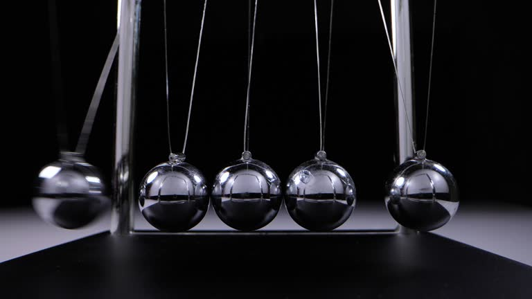
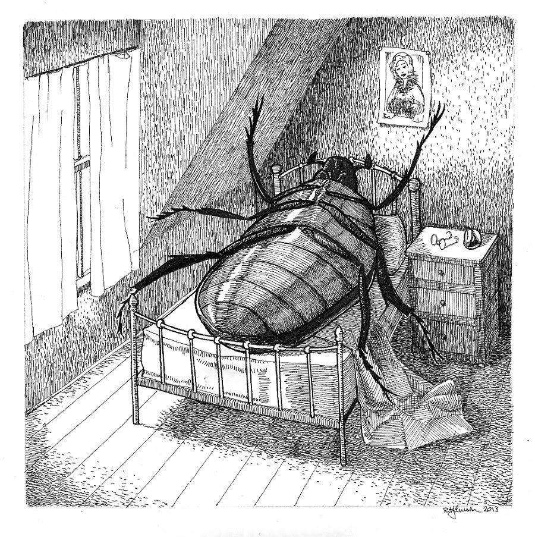
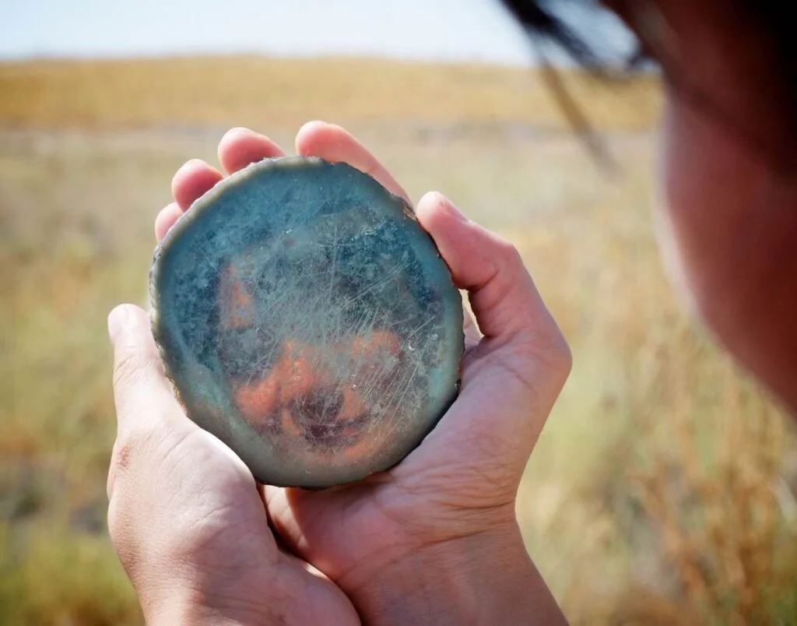

### A Dor Sombria

Aproximadamente 1 em cada 6 pessoas no mundo sofre com alguma desordem de saúde mental, num país como o Brasil se estima que ao menos 11% das pessoas já sofreu de depressão.

Nós estamos numa sociedade em que infelizmente muitas pessoas não tem acesso a saúde mental e não tem acesso a informação que as levaria a procurar ajuda, nesse mundo atual tudo é criado para ser padronizado ou mecanizado e enquanto isso a verdade é sorrateiramente posta debaixo do tapete: Não existe Ser Humano igual ao outro, é impossível serializar a existência humana.

Com o advento da inteligencia artificial e das máquinas, cada vez nos aproximamos dos cenários mais distópicos há muito previsto por autores de ficção cientifica, a perfeita escravidão, o Ser que vive apenas para servir ao progresso faminto e insustentável do Capitalismo.

Nada disso exclui ou apaga a Dor interna que muitos sentem, pelo contrário, só a ressalta, essa dor que muitos podem taxar com diversos rótulos como depressão, falta de sentido, burnout, ansiedade crônica, mas que advém de uma mesma fonte: A aceleração excessiva do mundo moderno e a falta de reflexão sobre a vida diária.

---
### O Sentido da Vida

Não cabe a mim refletir profundamente sobre o sentido de viver, cada Ser Humano deve buscar sua própria resposta e é aí que reside o maior problema, muitas pessoas hoje em dia não o procuram.
É muito difícil viver sem um forte bastião, um suporte sólido que se use para acordar dia após dia, porém a culpa não é do indivíduo, a sociedade não se preocupa nem um pouco em valorizar o conhecimento profundo e a sabedoria, o foco é claro e simples, criar mão de obra para um sistema prestes a falir.

Porém é dito fortemente por vários renomados estudiosos da mente humana, existe a necessidade de termos contato com algo sagrado para nós, algo numinoso, não precisa ser a religião necessariamente, mas faz bem para a consciência possuir um sentido maior, enxergar uma ordem cósmica, pode ser através do próprio Universo e Natureza, desde que haja essa visão de conjunto. 
Uma visão de conjunto nos leva a buscar o sentido da vida, e então floresce a grande e necessária pergunta, "para que", para que meu trabalho serve, para que eu faço as coisas do jeito que eu faço, em que isso encaixa no grande esquema das coisas, qual o meu lugar na dança cósmica?

Tenho a impressão de que muitas pessoas que sofrem da dor silenciosa, na maior parte das vezes carecem dessa oportuna pergunta sobre si mesmo e o seu entorno, é claro, não se pode generalizar e todo caso é único, mas o sofrimento é um canal para a mudança, o atrito é que gera a maior mudança.
Conforme a sabedoria chinesa explica: É no momento em que se aplica a maior força em determinada polaridade que a mudança acontece.

 
---
### O Agente da Metamorfose

Deixo claro que não pretendo reduzir a dor ou o sofrimento de ninguém, quero apenas destacar alguns pontos como alguém que já muito passou por períodos de profunda depressão e que após se recuperar, tirou algumas conclusões sobre si e o entorno.

Para mim o sofrimento, principalmente aquele mais profundo, que nos leva a questionar tudo e nos faz sentir incapazes de se mover é o arauto de uma grande mudança, e se temos força o suficiente para ouvirmos a voz desse movimento, somos capazes de nos reinventar totalmente.
Sei que isso é muito difícil e não existe algo como "é só aguentar, é só mudar", para quem está no fundo do poço, a menor brisa já é capaz de fazer tremer dos pés a cabeça.

No meu caso o que me ajudou em meu momento mais profundo foi de fato, passar a enxergar a profundidade na existência e a singularidade da vida, em como tudo tem seu papel e orquestra uma música única e equilibrada. Foi enxergar a existência de Deus, não como velho barbudo que a tradição nos dogmatiza, mas como linha forte que une todas as coisas e que não diferencia o que toca com a justiça da criação.

Se por um mistério da vida nós somos capazes de levantar e nos recuperar um passo de cada vez, voltamos mais fortes e capazes de fazer grandes mudanças, pois aquela dor e incompreensão se torna revolta, revolta contra a falta de existência, contra o viver pra sobreviver, contra os capatazes que geram as sombras na caverna.

---
### Auto-Conhecimento, o Bem mais valioso do mundo

Nem todo o ouro, diamantes, eletrônicos, dinheiro e prazeres do mundo podem substituir o "conhece-te a ti mesmo", somente através do contentamento consigo mesmo, de saber quem se é, é que podemos chegar a plena felicidade.

O melhor conselho para aquele que se encontra no abismo que posso deixar é, não desista de si mesmo, sempre há um caminho, o universo que tem a nossa volta se estende também em nosso interior, nós não estamos quebrados, apenas estamos mal posicionados e nunca é tarde para se reposicionar e mudar o rumo da nossa vida.

Conhecer profundamente a si mesmo é mais poderoso do que qualquer oráculo, magia ou profeta, através desse conhecimento podemos traçar com precisão um caminho que nos fortalece, que nos alegra e nos dá força e energia em nossos dias.
Obviamente o Sistema quer fazer de tudo para afastar o indivíduo desse caminho, mas é impossível conter a torrente da vontade quando essa floresce.

Tudo o que precisamos pra viver jaz dentro de nós mesmos, cada sentimento, cada dor, cada desejo nos comunica algo, uma mensagem que muitas vezes ignoramos por desconhecimento ou orgulho, mas que é essencial para ajeitarmos nosso curso nessa grande nave que se chama Planeta Terra.

Não existe uma verdadeira separação em nossos Sistemas, temos que compreender que a separação é apenas virtual para fins de estudo pois corpo, mente e sentimento trabalham juntos e em constante estado de compensação, se a mente se esgota, corpo e sentimento sofrem e por aí vai.

É essencial que se ouça e entenda a linguagem interior tanto quanto nos esforçamos para entender e observar o exterior, pois só assim somos capazes de encontrar o equilíbrio para podermos voltar a sorrir.
